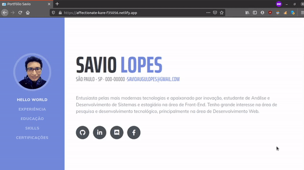

<h3 align="center">
  
</h3>

<p align="center"> 💬 <strong>Portfolio dev com Gatsby e D3.js</strong> 🚧
 </p>
  
<br>

<p align="center">
   
  
  <a href="https://github.com/savio-2-lopes">
    
  </a>
 
 <a href="https://github.com/savio-2-lopes">
    
  </a>
</p>

<br> 

## :pushpin: Índice

- [Sobre](#sobre-o-projeto)
- [Layout](#layout)
- [Deploy](#deploy)
- [Como Executar](#executar)
- [Tecnologias](#tecnologias)
- [Licença](#licenca)
- [Autor](#autor)

<br>

<a id="sobre-o-projeto"></a>

## 💻 Sobre o projeto

🚀 A aplicação é consiste em um Portfolio dev de palco desenvolvido utilizando Gatsby e D3.js. 

<br>

💡 Desenvolvido durante o Workshop ministrado pela dev Fabi Rodrigues, no evento [DoWhile 2020](https://dowhile.rocketseat.com.br) e utilizando como base a aplicação [gatsby-starter-resume](github.com/anubhavsrivastava/gatsby-starter-resume).

<br>

<a id="deploy"></a>

## ⚡ Deploy

🎲 Segue abaixo o link do Deploy da Aplicação
<br><br>
🔗 [Deploy da Aplicação](https://affectionate-kare-f35056.netlify.app).

<br>
<a id="layout"></a>

## 🎨 Layout

### Web

<p align="center" style="display: flex; align-items: flex-start; justify-content: center;">
  
</p>

<br>

<a id="executar"></a>

## 🚀 Como executar o projeto

### Pré-requisitos

Antes de começar, você vai precisar ter instalado em sua máquina as seguintes ferramentas:
[Git](https://git-scm.com), [Node.js](https://nodejs.org/en/) e o gerenciador de pacotes [Yarn](https://yarnpkg.com).
Além disto é bom ter um editor para trabalhar com o código como [VSCode](https://code.visualstudio.com/)

<br>

Certifique-se de ter o programa Gatsby CLI instalado:

```sh
npm install --global gatsby-cli
```

E execute a partir de sua CLI:

```sh
gatsby new <nome-aplicacao> https://github.com/savio-2-lopes/Portfolio-Dev-Gatsby.git
```

Então você pode executá-lo:

```sh
cd Portfolio-Dev-Gatsby
npm install
gatsby develop
```

<br>

<a id="tecnologias"></a>

## 🛠 Tecnologias

As seguintes ferramentas foram usadas na construção do projeto:

- [Node.js](https://nodejs.org/en/)
- [Gatsby.js](https://www.gatsbyjs.com/)
- [React Bubble Chart D3](https://github.com/weknowinc/react-bubble-chart-d3)
- [Gatsby Starter Resume](github.com/anubhavsrivastava/gatsby-starter-resume)

<br>

<a id="licenca"></a>

## :memo: Licença

Este projeto está sob a licença do MIT. Veja a [página de licença](https://opensource.org/licenses/MIT) para mais detalhes.
